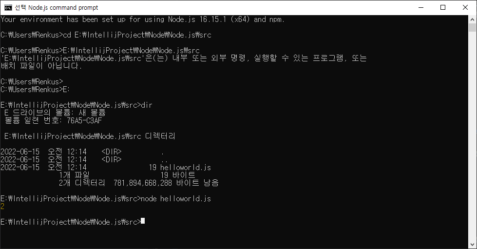
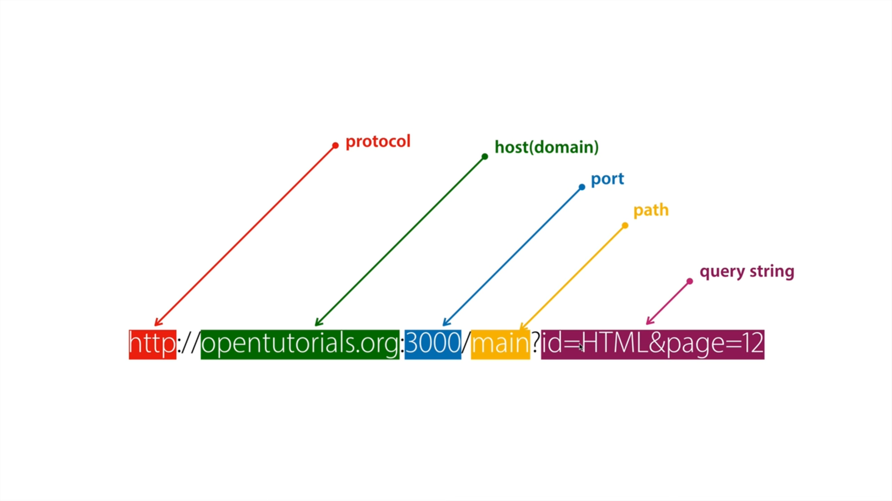

# Node.js

## 1. 수업소개(Node.js 역사)

1990에 WEB이 처음 등장하면서 WEB페이지에 표현이 가능해지면서, 종이로 되어있는 정보들을 WEB페이지에 담기 시작하였습니다.  

HTML에 담기 시작했는데 불만이 생기게 되었습니다. HTML에 수동으로 하나씩 작업을 해야했기 때문입니다.  

그리고 모든 방문자들이 글을 올릴 수 있게 하고 싶었지만 위험부담 때문에 웹 소유자만이 수정할 수 있어야 했습니다.  

그렇다보니 귀찮고 반복적인 HTML 작업을 기계가 직접 할 수 있게 하고싶었습니다. 그래서 만들어진게 Node.js 입니다.  

이미 JavaScript에 익숙한 사람들이 배우지 않고 웹 페이지를 자동으로 생성하는 서버 쪽 애플리케이션을 만들수 있게 하고 싶었습니다.  

1995년 상업용 웹브라우를 만든 Netscape의 회사에서 브랜든 아이크에게 JavaScript 제작을 의뢰합니다.  

이 JavaScript를 통해 사용자와 상호작용하는 애플리케이션의 면모를 갖추게 됩니다.  

문서에서 애플리케이션으로 확장되는 단계였습니다. 컴퓨터 프로그래밍 언어로써 독점적인 부분도 있었지만,  

반대로 웹 브라우저에서 밖에 사용 할 수 없는 편파적인 언어의 모습도 가지고 있었습니다.

2008년 구글이 크롬 웹브라우저에서 동작하는 자바스크립트의 성능을 개선하기 위해서 V8엔진을 개발, 이걸 오픈 소스로 공개합니다.  
그리고 그걸 Node.js 창시자인 라이언 달은 V8엔진을 기반으로 하는 Node.js를 만들게 됩니다.  
Node.js를 통해 JavaScript가 웹 브라우저를 제어하는것이 아닌 컴퓨터 자체를 제어하도록 만들었습니다.  
(파이썬, Java, PHP, 루비)  

Node.js 개발 이후 웹 브라우저가 아닌 다른 영역으로 확대가 되기 시작하게 되었습니다.

## 2. 수업의 목적

HTML 소스에서 태그를 수정하려고 한다면 각 파일의 태그를 하나씩 수정하여야 합니다.  

그 태그가 갯수가 많으면 많을수록 수정해야 하는 태그들이 많아집니다.  

이런 상황에서 Node.js가 되어있다면 파일의 특정 태그만 수정하게 된다면 수정이 필요한 모든 부분의 태그가 수정이 됩니다.  

화면을 생성하는것도 가능하고 삭제, 수정도 페이지에서 진행하면 파일이 생성, 수정, 삭제도 가능하게 됩니다.

이런걸 Node.js 설정을 통해 작업을 할 수 있습니다.

## 3. Node.js 설치파일 방법

>https://nodejs.org/ko/

해당 Url에서 설치 파일을 다운받아 설치 후 cmd창을 통해 'node -v'나, 'node', 'npm'을 통해 설치가 된건지 확인할 수 있다.

프로젝트 생성 후 js파일을 생성하여 console을 적어주고, cmd 창에서 해당 디렉토리 경로로 이동 후 해당 js를 node로 부르면 comsole의 값이 표시되게 된다.

> 1. Intellij에서도 프로젝트를 생성하여 작업을 수행할 수 있다. 이 부분은 확인이 추가로 필요해 보인다.  
> 참고 Url : https://hoonjo.tistory.com/15  
> 
> 2. 생성할 때 package manager와 template가 뭔지 궁금해서 찾아보았더니 package manager는 패키지 관리자이다. 말 그대로 패키지를 관리해주는 종류인것이다.  
> 참고 Url : https://yceffort.kr/2022/05/npm-vs-yarn-vs-pnpm  
> 
> 3. template의 경우 템플릿 엔진이라는건데 Java Script를 사용해서 HTML을 랜더링할 수 있게 도와주는 도구다.
> 참고 Url : https://velog.io/@juneverbena/Node.js-%ED%85%9C%ED%94%8C%EB%A6%BF%EC%97%94%EC%A7%84, https://yahohococo.tistory.com/43

## 4. JavaScript 데이터 타입 종류

1. Number(숫자)
2. String(문자)
3. Variable 형식 및 활용

## 5. Template Literal

String을 변수에 넣게 되면 줄 바꿈이나 데이터를 넣는 방식에 대해 불편함이 있다.

그럴경우 Template Literal를 사용하여 문자를 편하게 수정하거나 할 수 있다.(백틱을 설명하는 것  같다.)

## 6. Url의 이해

>출처 : https://www.youtube.com/watch?v=Zhbvui_T9VY&list=PLuHgQVnccGMA9QQX5wqj6ThK7t2tsGxjm&index=14

만약 포트번호를 80으로 했다면 포트번호를 적지 않아도 된다.  
왜냐하면 웹서버는 굉장히 유명한 서버여서 80번 포트를 쓴다 라고 전세계적으로 약속이 되어있기 때문이다.  
기본값이 80인 것이다.

쿼리스트링의 경우 ? 로 시작되고, 값과 값은 & 를 써서 구분, 값의 이름과 값은 = 을 쓰기로 약속되어있다.

## 7. Node.js의 파일 읽기 기능, 파일을 이용해 본문 구현

readFile을 통해서 같은 경로안에 있는 파일을 호출해오는 형태로 판단된다.

> HTML 화면에서 image를 불러오지 못하는 이유는 서버에 이미지 파일이 없기 때문이다.  
> 서버 기동 후 요청 Url이 root로 시작되기에 이미지를 못불러오는 것이다.  
> 자세한건 좀 더 테스트를 진행해야 할 것 같다.  
> 참고 Url : https://not-to-be-reset.tistory.com/263  
> 그리고 Main으로 넘어갔을 때 undifind가 뜨는 이유도 찾아봐야 할 것 같다.

## 8. 조건문

conditional

## 9. App 제작 - 홈페이지 구현

7의 메모에 보면 Main의 undifind의 경우 구현을 하지 않아서 그렇다.  
구현 작업 후 강의 마지막 부분에서 얘기하시는게 하단의 부분이 빠져도 된다고 하셨다.

> if (pathName === '/') {  
> if (queryData.id === undefined) {  
> fs.readFile(`data/${queryData.id}`, 'utf-8', function (err, description) {

왜 그럴까 고민 해봤는데 Main 페이지의 경우 queryData.id의 값이 필요 없기 때문이다.

## 10. 글목록 츌력하기

readdir을 통해서 특정 디렉토리의 파일들의 정보를 불러올 수 있다.

> fs.readdir(testFolder, function(error, filelist){ console.log(filelist); })

그걸 통해서 디렉토리의 파일의 리스트를 호출, 표현해줄 수 있다.

## 11. Function

## 12. 동기와 비동기

readFileSync => 동기방식
readFile => 비동기방식

## 13. Callback

